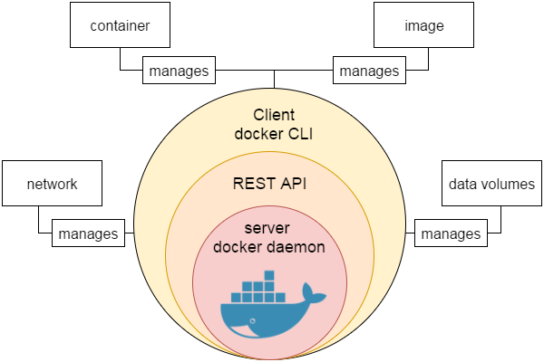

## 介绍
### 1.Docker简介

* 开源的应用引擎 Go语言

* 开发者打包他们的应用以及依赖包到一个轻量级、可移植的容器中，然后发布到任何流行的Linux机器上，也可以实现虚拟化。

* 完全沙盒机制，应用之间不会有任何接口（类似 iPhone 的 app），更重要的是容器性能开销极低。

### 2. 应用场景

* Web应用的自动化打包和发布


* 自动化测试和持续集成、发布

* 在服务型环境中部署和调整数据库或其他的后台应用

* 从头编译或者扩展现有的OpenShift或Cloud Foundry平台来搭建自己的PaaS（Plattorm-as-a-Service，平台即服务）环境

### 3.优点
* 简化程序：Docker让开发者可以打包他们的应用以及依赖包到一个可移植的容器中，然后发布到任何流行的Linux机器上，便可以实现虛拟化。Docker改变了虛拟化的方式，使开发者可以直接将自己的成果放入Docker中进行管理。方便快捷已经是Docker的最大优势，过去需要用数天乃至数周的任务，在Docker容器的处理下，只需要数秒就能完成。

* 避免选择恐惧症：如果你有选择恐惧症，还是资深患者。Docker帮你打包你的纠结！比如Docker镜像；Docker镜像中包含了运行环境和配置，所以Docker可以简化部署多种应用实例工作。比如Web应用、后台应用、数据库应用、大数据应用比如Hadoop集群、消息队列等等都可以打包成一个镜像部署。

* 节省开支：一方面，云计算时代到来，使开发者不必为了追求效果而配置高额的硬件，Docker 改变了高性能必然高价格的思维定势。Docker与云的结合，让云空间得到更充分的利用。不仅解决了硬件管理的问题，也改变了虚拟化的方式。

### 4.对比
虚拟机的缺点：

* 资源占用多
虚拟机会独占一部分内存和硬盘空间。它运行的时候，其他程序就不能使用这些资源了。哪怕虚拟机里面的应用程序，真正使用的内存只有1M，虚拟机依然需要几百MB的内容才能运行。
冗余步骤多：虚拟机是完整的操作系统，一些系统级别的操作步骤，往往无法跳过，比如用户登录。

* 启动慢
启动操作系统需要多久，启动虚拟机就需要多久。可能要等几分钟，应用才能真正运行。

由于虚拟机存在这个缺点，Linux发展出了另一种虚拟化技术：Linux容器(Linux Containers,缩写为LXC)。

Linux容器：
不是模拟一个完整的操作系统，而是对进程进行隔离。或者说，在正常进程的外面套了一个保护层。对于容器里面的进程来说，它接触到的各种资源都是虚拟的，从而实现与底层系统的隔离。
由于容器是进程级别的，相比虚拟机又很多优势。

* 启动快
容器里面的应用，直接就是底层系统的一个进程，而不是虚拟机内部的进程。所以，启动容器相当于启动本机的一个进程，而不是启动一个操作系统，速度就快很多。
* 资源占用少
容器只占用需要的资源，不占用那些没有用到的资源；虚拟机由于是完整的操作系统，不可避免要占用所以资源。另外，多个容器可以共享资源，虚拟机都是独享资源。
* 体积小
容器只要包含用到的组件即可，而虚拟机是整个操作系统的打包，所以容器文件比虚拟机文件要小很多。总之，容器有点像轻量级的虚拟机，能够提供虚拟化的环境，但是成本开销小得多。


### 5.Docker引擎
Docker引擎是一个包含以下主要组件的客户端服务器应用程序：
* 一种服务器，它是一种称为守护进程并且长时间运行的程序。

* REST API用于指定程序可以用来与守护进程通信的接口，并指示它做什么。

* 一个有命令行界面(CLI)工具的客户端。



### 6.功能特点
* 轻松快捷的配置⭐
可帮助我们轻松快速地配置系统。可以在更少的时间和精力的情况下部署代码。由于Docker可以在各种各样的环境中使用，基础架构不再要求与应用程序的环境相关联。

* 提高工作效率
通过放宽技术配置和应用的快速部署。毫无疑问，它节约了时间提高了生产率。Docker不仅有助于在孤立环境中执行应用程序，而且还减少了资源。

* 应用隔离
Docker提供用于在隔离环境中运行应用程序的容器。每个容器独立于另一个容器，并允许执行任何类型的应用程序。


* 云调度（集群）
它是Docker容器的集群和调度工具。Swarm使用Docker API作为其前端，这有助于我们使用各种工具来控制它。它还可以将Docker主机集群控制为一个虚拟主机。这是一个用于启用可插拔后端的自组织引擎组。

* 路由网（容器之间的连接）
它将可用节点上已发布端口的传入请求路由到活动容器。即使节点上没有任务正在运行，此功能也可以实现
连接。

* 服务
服务是允许指定集群内的容器状态的任务列表。每个任务表示一个应该运行的容器的一一个实例，并且Swarm在节点之间调度它们。

* 安全管理
它允许将保密数据保存到云群(swarm)中，然后选择给予服务访问某些保密数据。它包括一些重要的命令给引擎，如保密数据检查，保密数据创建等。

### 系统架构
客户端-服务器(C/S)架构模式，使用远程API来管理和创建Docker容器

类比：
Java
类——对象
Docker
容器——镜像

过程图：
Client
--docker build
--docker pull
--docker run

## 安装(ubuntu)

可以在任何操作系统上安装Docker
无论是Mac、Windows、Linux 还是任何云服务器


### 要求
Linux：
64位
```
uname --m
```

内核版本3.10或更高
```
uname -r
```

### 方法
使用脚本安装Docker
使用在线安装脚本
```
curl -sSL https://get.daocloud.io/docker | sh
```


## 命令

[Docker的基本命令](https://blog.csdn.net/lizhiqiang1217/article/details/89070075)

