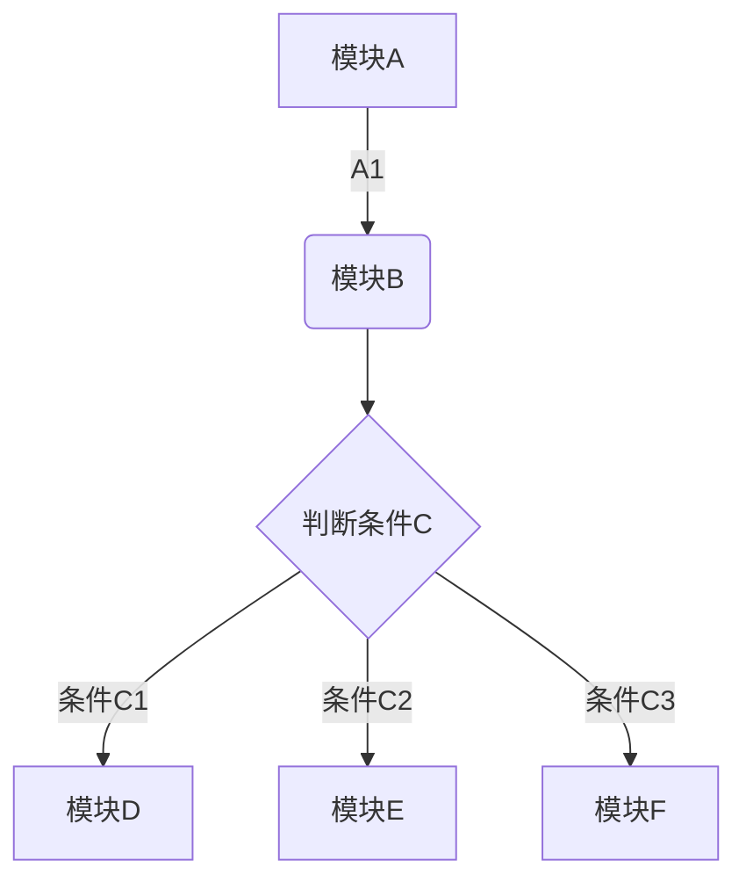
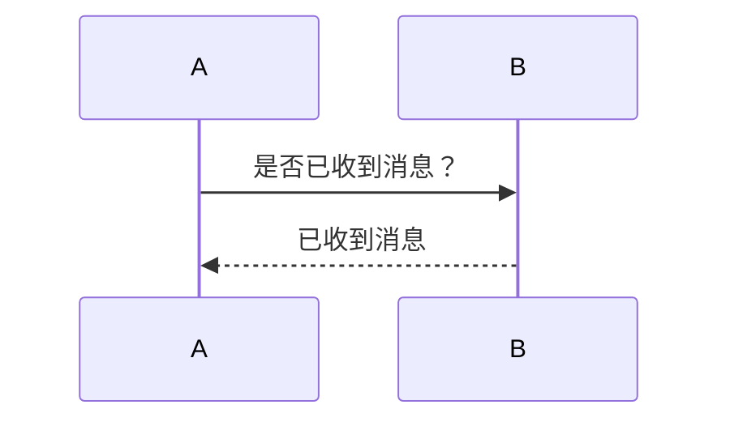
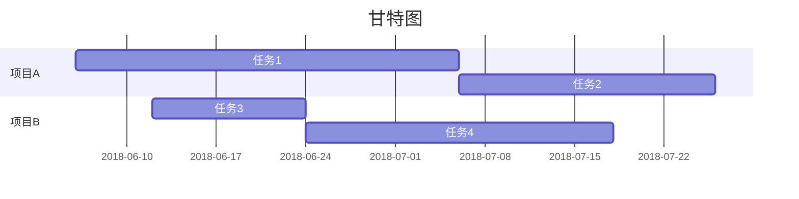

## 设置分级标题

```markdown
# 一级标题
## 二级标题
### 三级标题
#### 四级标题
##### 五级标题
###### 六级标题
```
## 加粗文本

```markdown
**加粗**
```
**加粗**

## 斜体

```markdown
*斜体*
```
*斜体*

## 下划线

```markdown
<u>下划线<u>
```
<u>下划线</u>

## 删除线

```markdown
~~删除线~~
```
~~删除线~~

## 添加分隔线
```markdown
分隔线上
* * *
分隔线下
```
分隔线上
* * *
分隔线下

## 引用文本
```markdown
>引用文本
```
>引用文本

## 添加符号列表或者数字列表
```markdown
1. 数字列表1
	* 符号列表1
	* 符号列表2
2. 数字列表2
3. 数字列表3
* 符号列表1
* 符号列表2
```
1. 数字列表1
	* 符号列表1-1
	* 符号列表1-2
2. 数字列表2
3. 数字列表3

* 符号列表1
* 符号列表2
  * 符号列表2-1
    * 符号列表2-1-1

## 添加待办事项
```markdown
* [x] 待办事项1
* [ ] 待办事项2
* [ ] 待办事项3
```
* [x] 待办事项1
* [ ] 待办事项2
* [ ] 待办事项3

## 插入链接

```markdown
[百度](https://www.baidu.com/)
```
[百度](https://www.baidu.com/)

## 插入图片
```markdown


```


## 插入表格
```markdown
|右对齐|左对齐|居中对齐|缺省|
|:-|-:|:-:|-|
|帐户流量|60M|1GB|10GB|
|设备数目|2台|无限制|无限制|
|当前价格|免费|￥8.17/月|￥12.33/月|
```
“|-|”中“-”的个数没有用

|右对齐|左对齐|居中对齐|缺省|
|:-|-:|:-:|-|
|帐户流量|60M|1GB|10GB|
|设备数目|2台|无限制|无限制|
|当前价格|免费|￥8.17/月|￥12.33/月|

| 右对齐   | 左对齐 | 居中对齐  | 缺省       |
| :------- | -----: | :-------: | ---------- |
| 帐户流量 |    60M |    1GB    | 10GB       |
| 设备数目 |    2台 |  无限制   | 无限制     |
| 当前价格 |   免费 | ￥8.17/月 | ￥12.33/月 |

## 插入图表(只有印象笔记能够实现)
目前支持饼状图、折线图、柱状图和条形图，只需将 type 改为对应的pie、line、column 和 bar。
```chart
,预算,收入,花费,债务
# 前面逗号不能省
June,5000,8000,4000,6000
July,3000,1000,4000,3000
Aug,5000,7000,6000,3000
Sep,7000,2000,3000,1000
Oct,6000,5000,4000,2000
Nov,4000,3000,5000,

type: pie
title: 每月收益
x.title: Amount
y.title: Month
y.suffix: $
# 后缀是：y.suffix: $
```

## 插入行内代码或代码块

```
插入行内代码或代码块
```

## 插入数学公式

```markdown
$$
e^{i\pi} + 1 = 0
$$

$$
y = k x + b \tag{1}
$$
```

$$
e^{i\pi} + 1 = 0
$$
$$
y = k x + b \tag{1}
$$

## 插入流程图
```markdown
定义流程图的元素：
（流程名=>关键字）:流程显示的文本 * 括号内部分不允许存在空格
流程执行过程：（流程名->流程名），通过符号 "->" 关联 括号内部分不允许存在空格
​```flow
// 按从大到小的顺序输出a,b,c
st=>start: 开始
in=>inputoutput: 输入数据a,b,c
cond1=>condition: a < b
op1=>operation: 交换a,b的值
cond2=>condition: b < c
op2=>operation: 交换b,c的值
out=>inputoutput: 输出数据a,b,c
e=>end: 结束

st->in->cond1  // 进入第一个选择分支
cond1(yes,right)->op1->cond2  
// yes 表示a < b 逻辑为真时的流程走向
// right 表示路径走向为向右，默认向下
cond1(no)->cond2
// 进入第二个选择分支
cond2(yes,right)->op2->out->e
cond2(no)->out->e
​```
```
```flow
st=>start: 开始
in=>inputoutput: 输入数据a,b,c
cond1=>condition: a < b
op1=>operation: 交换a,b的值
cond2=>condition: b < c
op2=>operation: 交换b,c的值
out=>inputoutput: 输出数据a,b,c
e=>end: 结束
st->in->cond1
cond1(yes,right)->op1->cond2  
cond1(no)->cond2
cond2(yes,right)->op2->out->e
cond2(no)->out->e
```



## 插入时序图


## 插入甘特图


## 设置目录
设置之后可以自动根据设置的分级标题来自动生成目录。
```markdown
[TOC]
```
[TOC]

