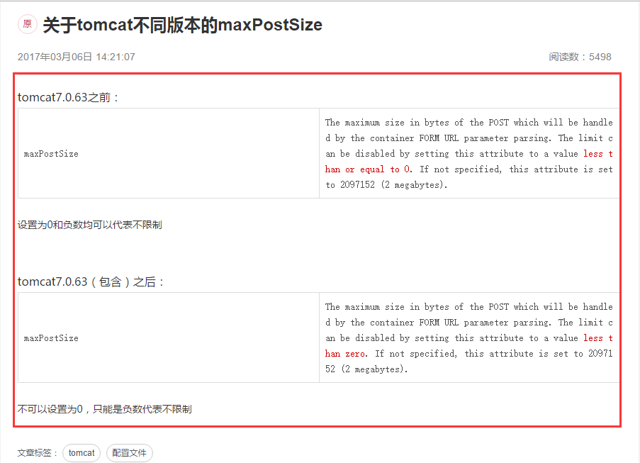

# 配置https协议

​	1.单向认证，就是传输的数据加密过了，但是不会校验客户端的来源 
​	2.双向认证，要求客户端浏览器没有导入客户端证书，是访问不了web系统的，找不到地址，双向认证的安全级别较高

## 方法

### 1.获得证书
购买或自制
（购买 阿里云免费申请1年https://www.aliyun.com/product/cas  JDK自带的keytool自己生成）
 JDK自带的keytool自己生成步骤：
	1.打开 JDK 自带的 keytool 目录
	2.按住 Shift 键，同时右键点击空白处。
	3.cmd窗口。输入keytool -genkeypair -alias "别名" -keyalg "RSA" -keystore "D:\生成地址.keystore" -validity 36500（有效期100年 默认90天）
	4.输入两次密钥、名字与姓氏:192.168.0.110或域名（以后访问的域名或IP地址，非常重要，证书和域名或IP绑定）、 剩下随便填
### 2.应用证书到Tomcat（SSL证书文件后缀可能是.keystore .pfx .jks 不影响配置 可以互相转换）
打开 Tomcat 配置文件 conf\server.xml
取消注释，并添加两个属性 keystoreFile，keystorePass。
	8.5之前
	<Connector port="8443" protocol="HTTP/1.1" SSLEnabled="true"
		maxThreads="150" scheme="https" secure="true" clientAuth="false" sslProtocol="TLS"
		keystoreFile="D:/生成地址.keystore" keystorePass="之前的密钥" />
	8.5之后
	<Connector port="8443" protocol="org.apache.coyote.http11.Http11NioProtocol" maxThreads="150" SSLEnabled="true">
		<SSLHostConfig>
			<Certificate certificateKeystoreFile="conf/SHA256withRSA__.powerchina.cn.jks"
				certificateKeystorePassword="dianjian123" type="RSA" />
		</SSLHostConfig>
	</Connector>
	(阿里云申请的配置keystoreFile是PFX证书文件地址，keystorePass是阿里云的订单号，keystoreType直接写PKCS12)
### 3.测试
启动tomcat并访问https://127.0.0.1:8443
如果把所有的8443改为443 则访问时 不需要加端口 即https://127.0.0.1
### 4.使用自己生成的证书会遇到几个问题
浏览器会对 HTTPS 使用危险标识。(我们开启 HTTPS 本意是为了更安全，增加用户信心。但是浏览器使用危险标识会适得其反，吓跑用户。)
浏览器默认不会加载非HTTPS域名下的javascript
移动设备显示页面空白(手机浏览器打开页面，也会像桌面浏览器一样弹出是否加载不受信任的页面，在微信中打开则会一片空白)
可以将证书的详细信息页面导出（复制到文件），导入浏览器（Internet选项——内容——证书——受信任的根证书颁发机构——导入证书）

### 5.配置强制访问https（按需 没用过）
tomcat /conf/web.xml 中的 </welcome-file-list> 后面加上以下内容
```
<login-config>  
    <!-- Authorization setting for SSL -->  
    <auth-method>CLIENT-CERT</auth-method>  
    <realm-name>Client Cert Users-only Area</realm-name>  
</login-config>  
<security-constraint>  
    <!-- Authorization setting for SSL -->  
    <web-resource-collection >  
        <web-resource-name >SSL</web-resource-name>  
        <url-pattern>/*</url-pattern>  
    </web-resource-collection>  
    <user-data-constraint>  
        <transport-guarantee>CONFIDENTIAL</transport-guarantee>  
    </user-data-constraint>  
</security-constraint>  
```
完成以上步骤后，在浏览器中输入http的访问地址也会自动转换为https了
	
# 换成https协议以后可能出现的问题

## 换https之前 系统正常，换了以后 不兼容IE9以下
因为浏览器的兼容模式是根据域名判断的 之前用的IP地址访问，不会用到兼容模式，用域名访问就会用到兼容模式

### 当时情况
1.必须使用IE浏览器
2.必须兼容IE7
3.必须使用特定域名访问（兼容性通过主域名判断 即 powerchina.cn）

### 解决办法
强制突破IE浏览器兼容性视图
几种形式：
<meta http-equiv="X-UA-Compatible" content="IE=edge" >
                          <meta http-equiv="X-UA-Compatible" content="IE=11" >
或
<%
   response.addHeader("X-UA-Compatible", "edge");// (似乎不起作用)
%>
或
nginx配置文件
location / {
	proxy_set_header  X-Real-IP       $remote_addr;
	proxy_set_header  X-Forwarded-For $proxy_add_x_forwarded_for;
	proxy_set_header  Host $http_host;
	proxy_pass     http://127.0.0.1:8080;
	client_max_body_size    1000m;
	add_header "X-UA-Compatible" "IE=11";
}

## https协议下部分浏览器保存报错
https携带参数限制
### 当时状况
1.http协议正常
2.https协议下
谷歌浏览器数据保存时 弹窗信息是错误页面 但保存正常
IE浏览器数据保存时 ajax返回信息是错误页面
tomcat控制台报错信息是 org.apache.axis2.transport.http.CommonsHTTPTransport
    org.apache.axis2.AxisFault
 但没有用到关于web service
### 原因
传输数据量过大 50到100条数据 但主要是大段的文字 
（Post提交本身对于参数的长度没有限制，HTTP协议也没有限制）
tomcat有限制

缺省的情况下是maxPostSize="2097152" 2M 单位是Byte
### 解决办法
1.保存时 去掉没用的数据
2.修改server.xml文件
maxPostSize="-1"
```
<Connector port="8443" protocol="org.apache.coyote.http11.Http11Protocol"
   maxThreads="150" SSLEnabled="true" scheme="https" secure="true"
   clientAuth="false" sslProtocol="TLS" maxPostSize="-1"
   keystoreFile="conf/文件.jks" keystorePass="密码" 
/>
```
https://blog.csdn.net/erlian1992/article/details/80209947

## SSO单点登录出现文件
### 当时状况
单独访问https的项目正常，从门户系统跳转出现问题
### 解决办法
查看报错信息
1.如果是**单点登录的验证**出现问题
 则查看单点登录的配置文件 sso-conf（本地可能没有 在服务器上）
2.单点系统中用户名修改 但本系统没改 导致用户名不匹配
 则重新配置组织结构里的用户名

## tomcat7漏洞过多
### 解决办法
升级tomcat 换成9
7到8、9 配置文件需要加上URIEncoding="ISO-8859-1"
7的request请求默认是ISO-8859-1
8、9的request请求默认是UTF-8